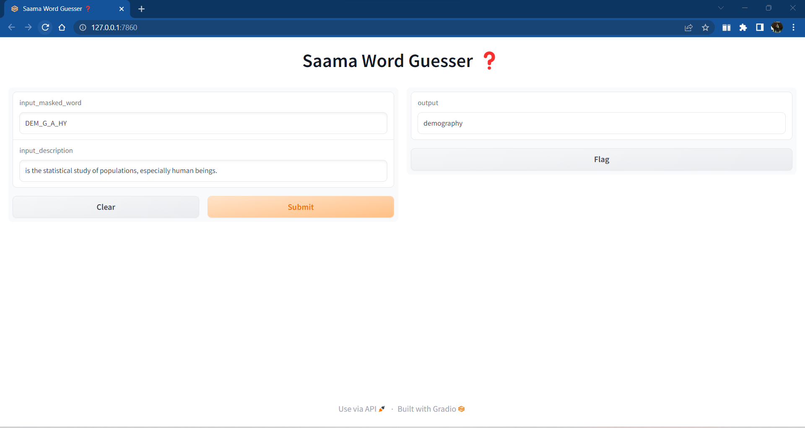

# Saama Word Guesser ❓

This project mimics the problem with hangman/dumb charades like NLP word games. This NLP model will predict the correct word from an intentionally obscured word based on its description.

## Example:

Input masked word = DEM_G_A_HY and

Description = is the statistical study of populations, especially human beings.

Model prediction/output = DEMOGRAPHY

## 

## Method to Execute the Project
1. Install the libraries using the command - pip install -r requirements
2. Run the app_gradio.py file - python3 app_gradio.py

### Training a model from Scratch

1. Run `python3 train.py --dataset_csv_path path/to/dataset.csv`, the csv must contain words in the first column, and their meanings in the second column.

For example, run `python3 train.py --dataset_csv_path ./data/train.csv` to train on English words (dataset included).

OR

1. Build docker image with `python3 build_container.py train`
2. Run `sudo docker run train path/to/dataset.csv`

### Gradio app

1. Run `python3 app_gradio.py` to launch gradio-based web-app.

OR

1. Build docker image with `python3 build_container.py inference_gradio`
2. Run `sudo docker run inference_gradio`

### Rest API

1. Run `python3 app_rest.py` to launch flask REST server.

OR

1. Build docker image with `python3 build_container.py inference_rest`
2. Run `sudo docker run inference_rest`

Example request

```
curl --header "Content-Type: application/json" \
--request POST \
--data '{"masked_word":"DEM_G_A_HY","description":"the statistical study of populations."}' \
http://127.0.0.1:5000/guess_word
```

## Project Details:
* `train.py` is the training script, uses PyTorch-Lightning, pass `--dataset_csv_path` argument to the script (works for the docker container as well).
* `tests` contains unit tests for modules in `core`
* `core` contains implementations of the dataset, model, tokenizer etc.
* `data` contains csvs for training, testing, dumped tokenizer etc.
* `build_tokenizer.py` builds a character-level tokenizer for a given CSV.
* `clean_data.py` is used for cleaning the open-source dataset used.
* `app_gradio.py` is a simple gradio inference for inference with a trained model (included).
* `app_rest.py` is a simple REST API (flask).
* `dockerization_app` contain `Dockerfile`s for inference and training.
* `build_container.py` builds docker containers for inference_gradio, inference_rest, and inference_training. Example: `python3 build_container.py inference_gradio`.
* `logs` contain the chekpoint of model.